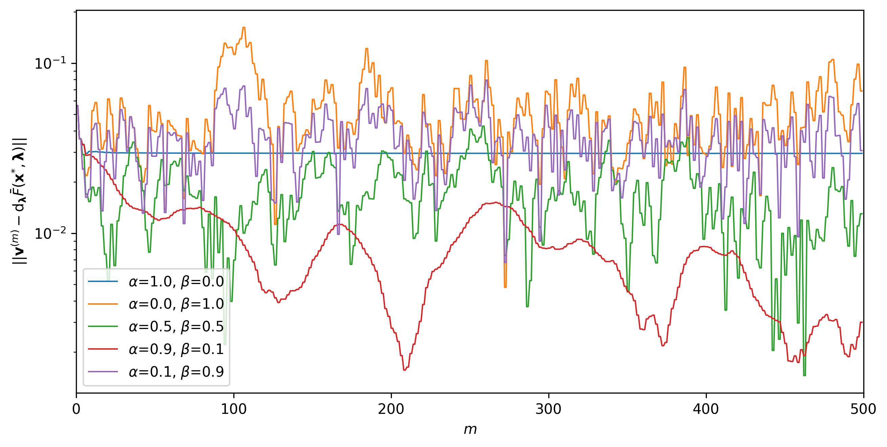

# Personalized Decentralized Bilevel Optimization over Random Directed Networks

This is the official implementation of the experiments in the following paper:

> Naoyuki Terashita and Satoshi Hara  
> [Personalized Decentralized Bilevel Optimization over Random Directed Networks](https://arxiv.org/abs/2210.02129)  
> *arXiv:2210.02129 (under review)*, 2022

## Environments

Our experimental results were made in a NVIDIA Docker container built
from [`docker/Dockerfile`](./docker/Dockerfile).
The container can be obtained by the following steps:

~~~
docker build ./docker/ --tag pdbo-hgp
nvidia-docker run -it -u user -v $PWD/pdbo-hgp:/home/user/pdbo-hgp -w /home/user/pdbo-hgp pdbo-hgp /bin/bash
~~~

## Experiments

### Federated EMNIST Classification

~~~
# Experiments on the fully-connected and static undirected communication networks
## PDBO-PL, PDBO-MTL, and PDBO-PL&MTL 
python main.py MakeAccuracyTableHyperSGDOnFedEmSetting config.paper.personalization_fedem_hgp --local-scheduler
## Baselines with hyperparameter tuning 
python main.py MakeAccuracyTableBaselineOnFedEmSetting config.paper.personalization_fedem_baseline --local-scheduler

# Experiments on the random undirected and random directed communication networks
## PDBO-PL, PDBO-MTL, and PDBO-PL&MTL
python main.py MakeAccuracyTableHyperSGD config.paper.personalization_sgp_hgp --local-scheduler
## Baselines
python main.py MakeAccuracyTableHyperSGD config.paper.personalization_sgp_baseline --local-scheduler
~~~

### (Appendix) Federated CIFAR10, CIFAR100, and Shakespeare on the random directed network

~~~
# PDBO-PL, PDBO-MTL, PDBO-PL&MTL, SGP (PDBO-PL with t_h=0), and SGP-MTL (PDBO-MTL at t_h=0)
## CIFAR10
python main.py MakeAccuracyTableHyperSGD config.paper.cifar10 --local-scheduler 
## CIFAR100
python main.py MakeAccuracyTableHyperSGD config.paper.cifar100 --local-scheduler
## Shakespeare
python main.py MakeAccuracyTableHyperSGD config.paper.shakespeare --local-scheduler

# Local and Local-MTL
## CIFAR10
python main.py MakeAccuracyTableHyperSGD config.paper.cifar10_local --local-scheduler
## CIFAR100
python main.py MakeAccuracyTableHyperSGD config.paper.cifar100_local --local-scheduler
## Shakespeare
python main.py MakeAccuracyTableHyperSGD config.paper.shakespeare_local --local-scheduler
~~~

### (Appendix) Comparison of α and β

~~~
python main.py PlotZipComputeHyperGradErrorOfSteps config.paper.compare_alpha_beta --local-scheduler
~~~

---
If you have questions, please contact Naoyuki
Terashita ([naoyuki.terashita.sk@hitachi.com](mailto:naoyuki.terashita.sk@hitachi.com)).
